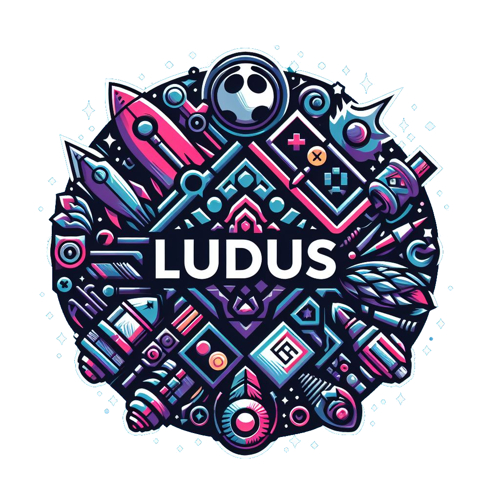

 <div align="center">
    
   <h1 align="center"> 
  
  `Ludus`

</h1>
 </div>


## Welcome to Ludus GameStore!

Ludus is not just a game store, it's a gateway to endless adventures and thrilling experiences. Whether you're a casual gamer or a hardcore enthusiast, Ludus has something for everyone.

### :fireworks:Features

- Explore a vast collection of games from various genres.
- Discover new releases and classics that will keep you entertained for hours.
- Read detailed game descriptions and reviews to make informed decisions.
- Create your own wishlist and keep track of your favorite games.
- Participate in community discussions and share your gaming experiences.

### :open_file_folder:Get Started

To get started with Ludus, follow these simple steps:

1. Clone this repository to your local machine.
    ```shell
git clone https://github.com/brunoliratm/Ludus-gemStore.git
```
2. Install the necessary dependencies.
3. Launch the application and start exploring the world of gaming.

### :zombie:Credits

| <a href="https://github.com/brunoliratm"><p>BrunoMagno</p></a> | <a href="https://github.com/P4UL0Jr"><p>P4ULOjr</p></a> |
| --- | --- |

### :handshake:Contributing

We welcome contributions from the open-source community. If you have any ideas, bug fixes, or feature requests, feel free to submit a pull request.

### :balance_scale:License

This project is licensed under the [MIT License](LICENSE).

